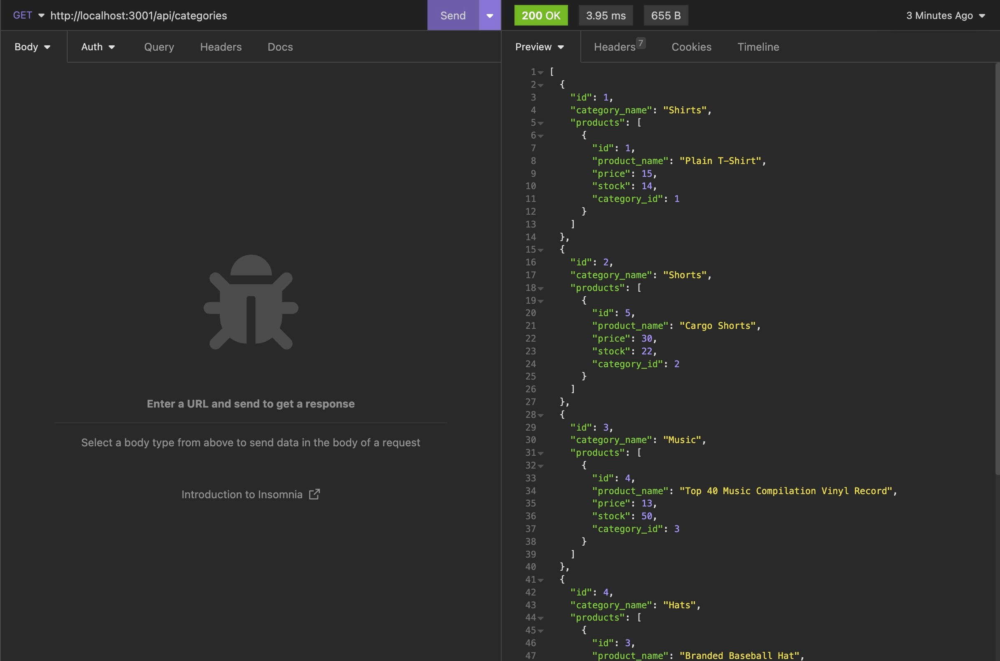

# Object-Relational Mapping (ORM): E-Commerce Back End Project

## Developer Notes
- To begin, please make sure to run the database schema file by logging into mySql and running 'source schema.sql'
- Seed files were already developed to add test data to the database. Please run the seed files by the following command: "npm run seed"
- To start the server please run the command "npm run start" or "node server.js"
- API routes have been configured with the following endpoints:
    - /categories
    - /tags
    - /products
- User will be able to run GET, PUT, POST and DELETE on these routes. Please view the /routes folder for more details on specific functionality. 

## HEROKU DEPLOY
- This wasn't necessary but application has also been deployed to Heroku at: 
https://radiant-spire-68138.herokuapp.com/

## Future Development Ideas
- Eventually I would like to hook up a front end via React to this server so a user has a nicer interface to view and manage their stock
- Possibly add another model to develop further associations with additional products or assets the owner may wish to incorporate into their ecommerce site.

## Walkthrough Video
- Link to walkthrough video can be found here: 
https://drive.google.com/file/d/17XdTWPIQ_fwMcfmYgtHJkDfZxOmWvlRA/view

## Screenshots
Example of GET Request:
